<p align="center">
  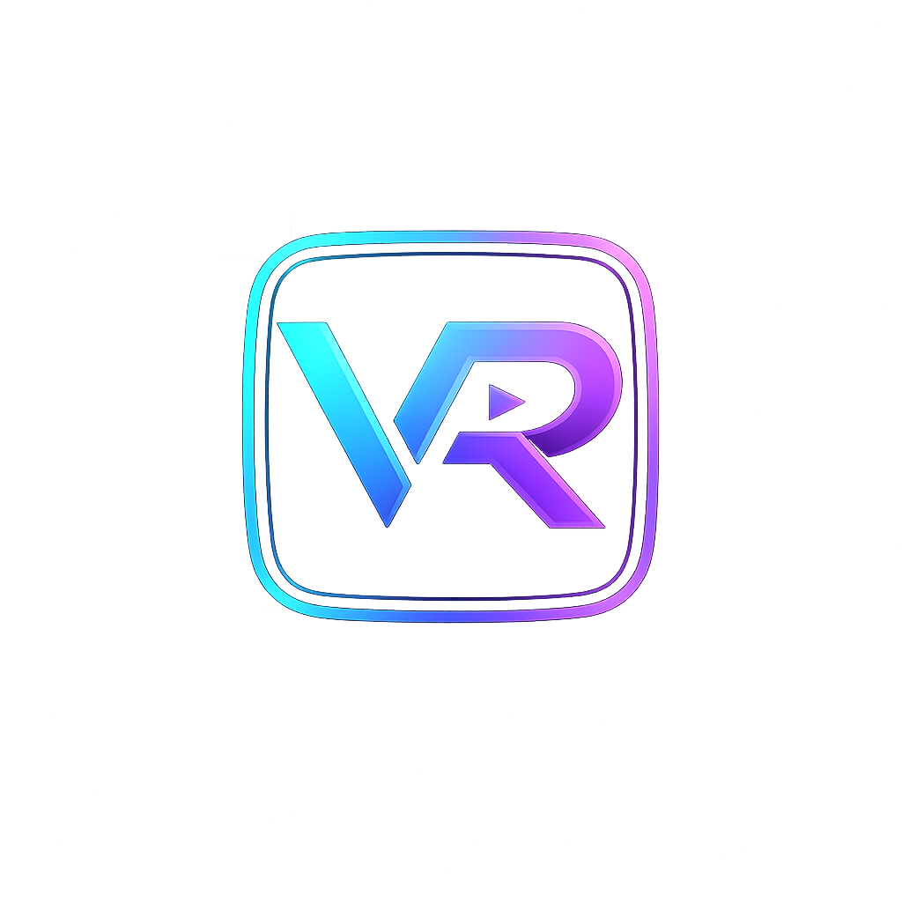
</p>

<h3 align="center">Your Personal Cinelog</h3>

<p align="center">
  A self-hosted movie and TV show tracker with a retro TV-inspired interface.<br />
  Rate, tag, discover, and track everything you watch — your way.
</p>

<p align="center">
  
  
  
  
  
</p>

---

## Screenshots

### Desktop

<p align="center">
  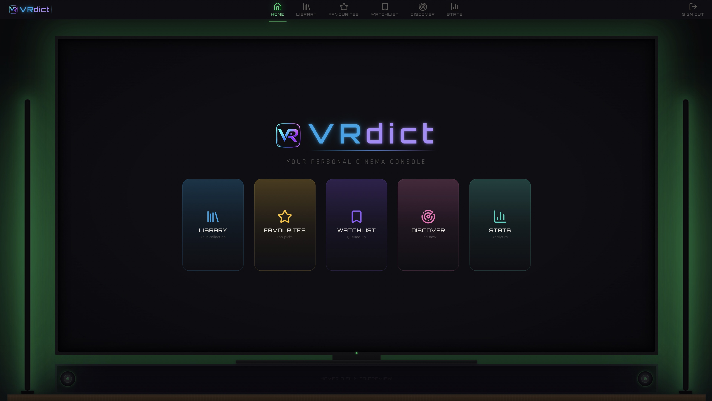
</p>
<p align="center"><em>Home — Welcome screen with TV frame, LED bars, and navigation cards</em></p>

<br />

<p align="center">
  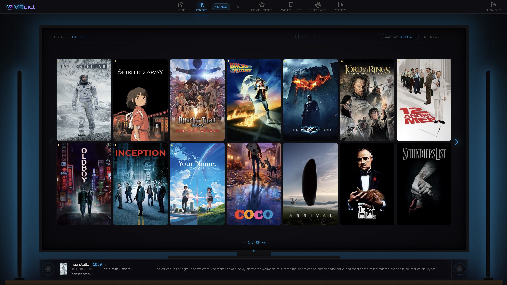
</p>
<p align="center"><em>Library — Your movie collection with poster grid and preview bar</em></p>

<br />

<p align="center">
  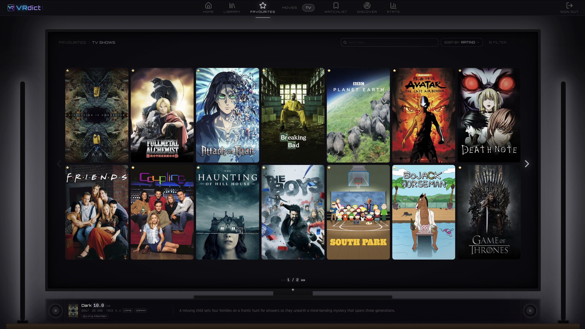
</p>
<p align="center"><em>Favourites — Your recommended picks with amber/gold glow theme</em></p>

<br />

<p align="center">
  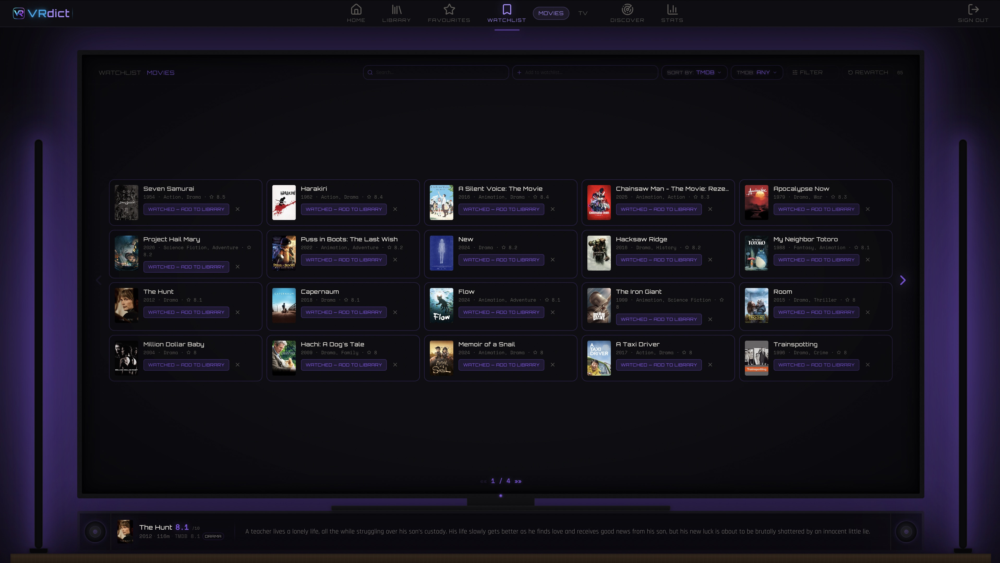
</p>
<p align="center"><em>Watchlist — Compact card view with genre tags and TMDB ratings</em></p>

<br />

<p align="center">
  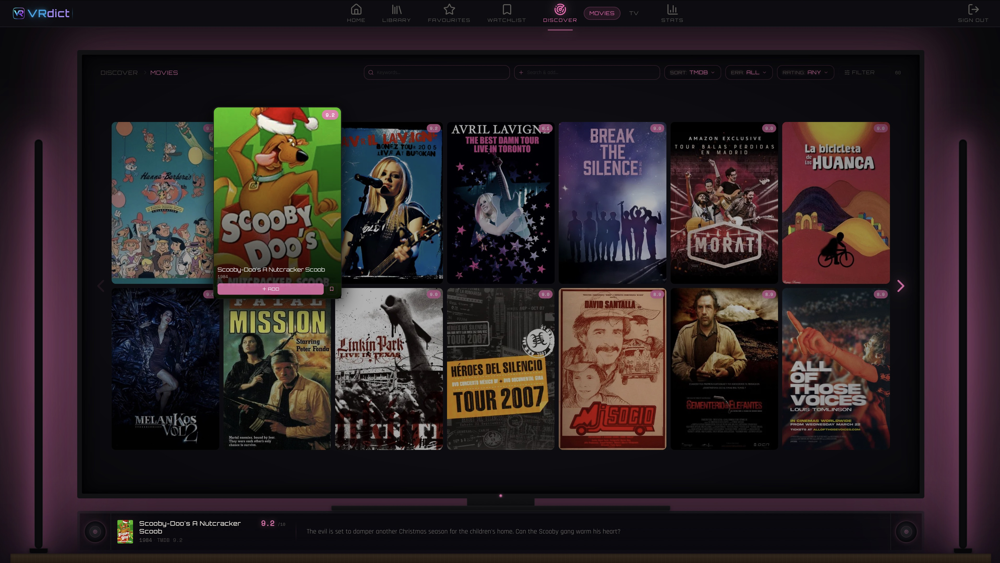
</p>
<p align="center"><em>Discover — Mood-based browsing with pink/magenta glow theme</em></p>

<br />

<p align="center">
  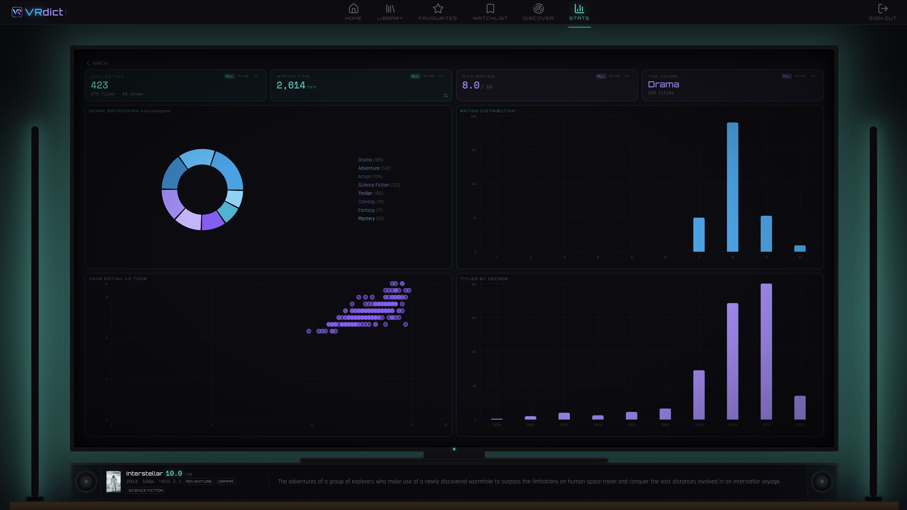
</p>
<p align="center"><em>Stats — Genre breakdown, rating distribution, and watch time analytics</em></p>

<br />

### Modals & Overlays

<p align="center">
  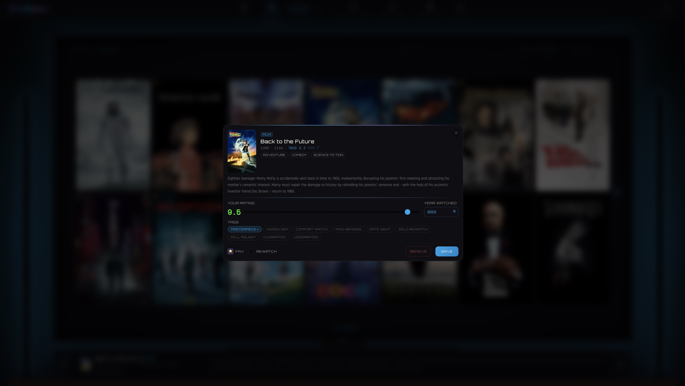
</p>
<p align="center"><em>Add Modal — Rate, tag, and log a movie with TMDB metadata pre-filled</em></p>

<br />

<p align="center">
  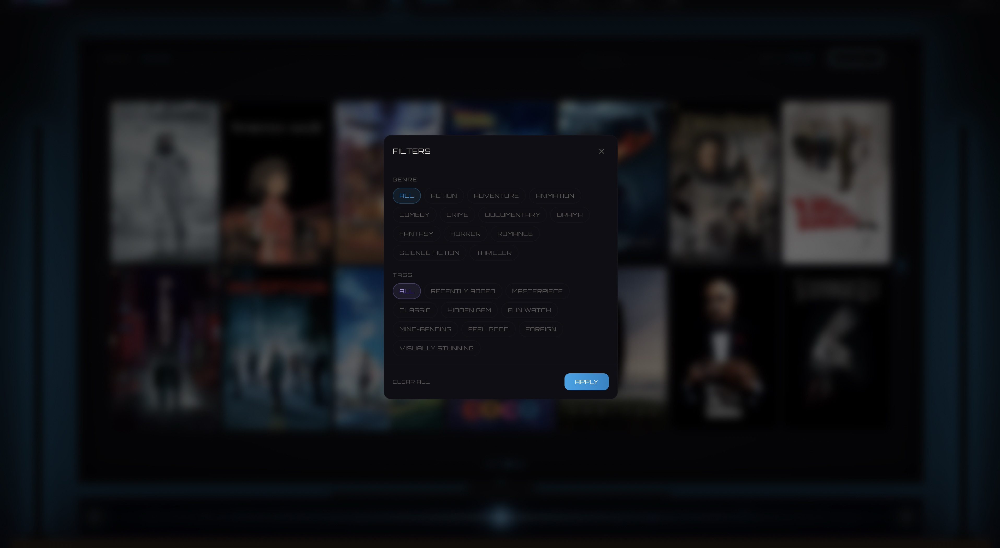
</p>
<p align="center"><em>Filter Drawer — Genre and tag filters with glass morphism overlay</em></p>

<br />

<p align="center">
  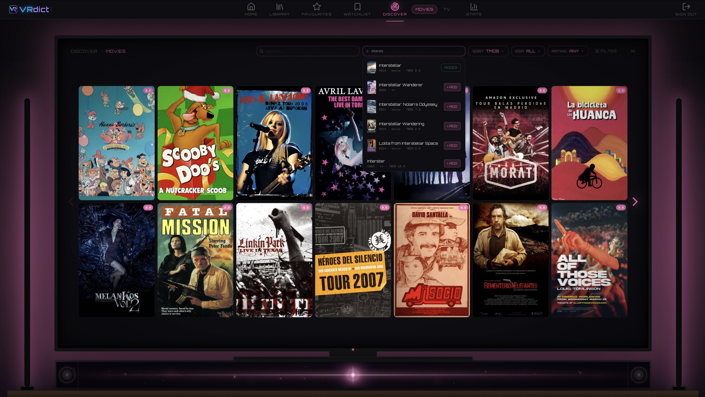
</p>
<p align="center"><em>Search Overlay — Discover page with inline search results</em></p>

<br />

<p align="center">
  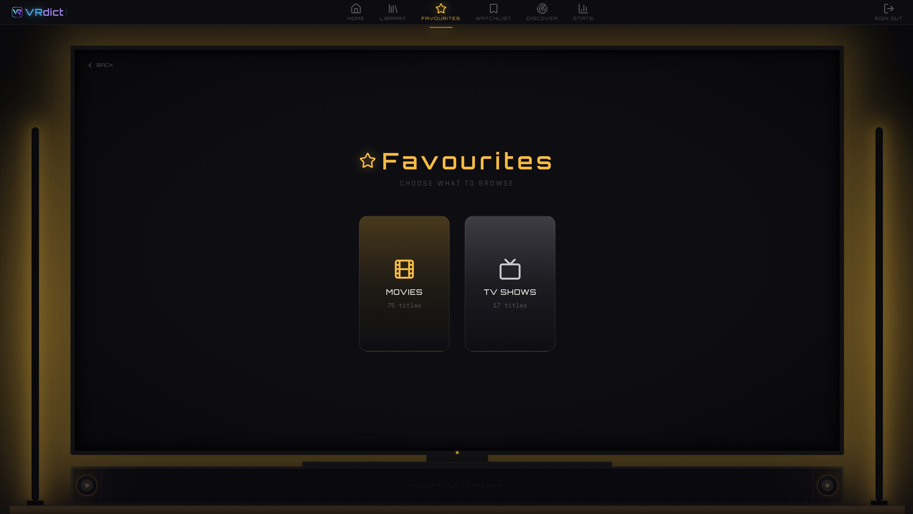
</p>
<p align="center"><em>Category select — Choose between Movies and TV Shows with page-themed glow</em></p>

<br />

### Mobile

| Library | Stats |
|---------|-------|
| 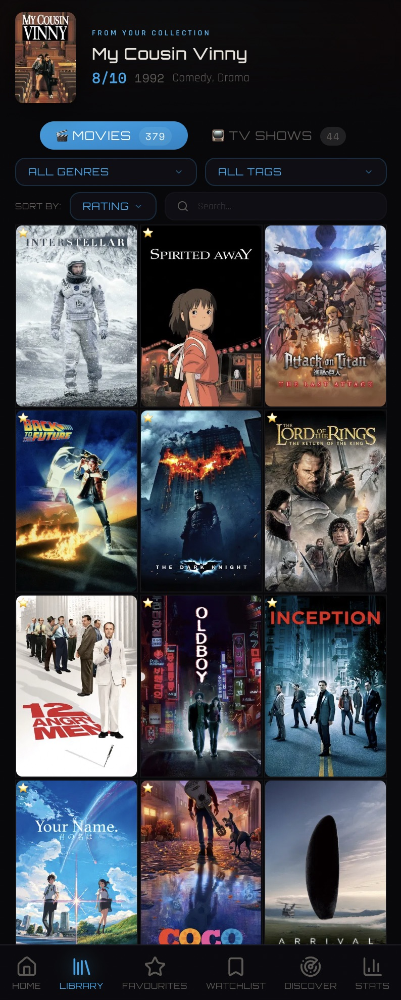 | 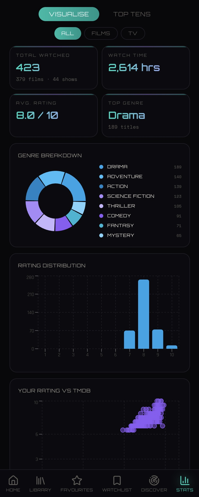 |
| Hero banner, poster grid, bottom nav | Full analytics dashboard on mobile |

---

## What is VRdict?

VRdict is a personal movie and TV show tracker built for people who want more control over how they log what they watch. It pulls metadata from TMDB, stores everything in your own Supabase database, and wraps it all in a retro TV-inspired interface with ambient glow effects, LED bars, and CRT-style animations.

It is **not** a social platform. There are no public profiles, no followers, no algorithmic feeds. It's your private collection — hosted on your own infrastructure.

### Why "VRdict"?

**V**arun's ve**rdict** on everything he watches. The name stuck.

---

## Features

### Library
Your watched collection. Every movie and TV show you've seen, with your personal rating (1-10), tags, and notes on when you watched it. Filter by genre, tag, or search by title. Sort by your rating, TMDB score, title, or year. Movies and TV shows live in separate tabs with independent counts.

### Watchlist
Your "to watch" queue. Add items from Search or Discover. When you're ready, promote them to the Library with a rating and tags. Supports sorting by TMDB rating, title, or year, and filtering by genre or minimum rating.

### Favourites
Your top picks — entries you've marked as "recommended". Same filtering and sorting power as the Library, but scoped to the titles you'd actually tell someone to watch.

### Discover
Mood-based and genre-filtered discovery powered by TMDB. Eight preset moods — Feel Good, Mind Bender, Edge of Seat, Epic Journey, Real Stories, Wild Ride, Dark & Gritty, Hidden Gems — each map to curated genre combinations. Layer on era filters (1950s through 2020s), minimum rating thresholds, and keyword searches. Results pull from multiple TMDB sort strategies (popularity, rating, vote count) and de-duplicate for variety.

### Stats
Two views — **Visualise** and **Top Tens**. The visualise view shows genre distribution (doughnut chart), rating distribution (bar chart), your rating vs TMDB's (scatter plot), decade breakdown, and total time watched (hours or days). Top tens ranks your highest-rated movies and TV shows. Filter all stats by movies, TV, or both.

### Search
Global search across TMDB's database. Debounced input, instant results. Each result shows poster, title, year, TMDB rating, and genre tags. One-tap add to Library (with rating modal) or Watchlist (instant).

### Tags
17 built-in tags: Masterpiece, Hidden Gem, Comfort Watch, Mind-Bending, Date Night, Solo Rewatch, Fell Asleep, Overrated, Underrated, Visually Stunning, Great Soundtrack, Slow Burn, Binge-Worthy, With Spouse, Nostalgic, Must Watch, Guilty Pleasure. Plus unlimited custom tags that you create yourself.

### TV Show Tracking
Track seasons watched separately from total seasons. The app stores per-season episode counts from TMDB, so your Stats page accurately calculates watched time for partially-completed series.

### Rewatch Tracking
Flag entries you plan to rewatch. Filter and find them easily across your collection.

---

## Design

The UI is built around a retro TV concept:

- **TV frame**: Desktop pages render inside a flatscreen TV bezel with a stand and power button (with animated shutdown/boot sequence)
- **LED bars**: Ambient glowing bars on left and right edges that pulse with page-specific colors
- **Page-specific glow**: Each page has its own color palette — cyan/violet for Library, amber/gold for Favourites, pink/orange for Discover, teal for Stats
- **Typography**: Orbitron for headings, Rajdhani for body text, Space Mono for numbers and stats
- **Glitch animation**: Welcome text flickers with a CRT-style glitch effect
- **Glass morphism**: Card panels with subtle backdrop blur
- **Preview bar**: On desktop, hovering over a card reveals a detailed info bar with rating comparison, tags, and edit access
- **Fully responsive**: Mobile gets a bottom nav, full-width cards, and auto-rotating hero banners. Tablet and desktop get progressively richer layouts.

---

## Tech Stack

| Layer | Technology |
|-------|-----------|
| Framework | [Next.js 16](https://nextjs.org) (App Router) |
| UI | [React 19](https://react.dev), [Tailwind CSS 4](https://tailwindcss.com) |
| Database & Auth | [Supabase](https://supabase.com) (PostgreSQL + Row Level Security) |
| Movie/TV Data | [TMDB API](https://www.themoviedb.org/documentation/api) |
| Charts | [Recharts](https://recharts.org) |
| Icons | [Lucide React](https://lucide.dev) |
| Fonts | Orbitron, Rajdhani, Space Mono (Google Fonts) |

---

## Self-Hosting Guide

VRdict is designed to run on **your own infrastructure**. You'll need a Supabase project and a TMDB API key. The app can be deployed to Vercel, Netlify, or any platform that supports Next.js.

### Prerequisites

- [Node.js](https://nodejs.org) 18+ installed
- A [Supabase](https://supabase.com) account (free tier works)
- A [TMDB](https://www.themoviedb.org) account (free API key)
- Git

### 1. Clone the Repository

```bash
git clone https://github.com/varunraturi56/vrdict-app.git
cd vrdict-app
npm install
```

### 2. Set Up Supabase

1. Go to [supabase.com](https://supabase.com) and create a new project.
2. Once the project is ready, go to **Settings > API** and note down:
   - **Project URL** (e.g. `https://abcdefg.supabase.co`)
   - **anon/public key** (starts with `eyJ...`)
   - **service_role key** (starts with `eyJ...` — keep this secret)
3. Go to the **SQL Editor** in your Supabase dashboard.
4. Open the file `supabase-schema.sql` from this repo and run the entire contents in the SQL Editor. This creates all required tables, indexes, row-level security policies, and triggers.

> **Important**: The schema includes RLS (Row Level Security) policies so each user can only access their own data. Do not skip this step.

### 3. Set Up TMDB API

1. Go to [themoviedb.org](https://www.themoviedb.org) and create a free account.
2. Navigate to **Settings > API** in your TMDB account.
3. Request an API key (choose "Developer" — it's instant and free).
4. Copy the **API Key (v3 auth)** — this is the key you need.

### 4. Configure Environment Variables

Create a `.env.local` file in the project root:

```env
# Supabase
NEXT_PUBLIC_SUPABASE_URL=https://your-project-id.supabase.co
NEXT_PUBLIC_SUPABASE_ANON_KEY=your-anon-key-here

# Supabase service role (server-side only — never expose to client)
SUPABASE_SERVICE_KEY=your-service-role-key-here

# TMDB
TMDB_API_KEY=your-tmdb-api-key-here

# Invite code for signup (change this to your own secret)
INVITE_CODE=your-secret-invite-code
```

> **Note**: The `INVITE_CODE` is required during signup. Set it to whatever you want — share it only with people you want to grant access. This prevents random signups on your instance.

### 5. Run Locally

```bash
npm run dev
```

Open [http://localhost:3000](http://localhost:3000). Sign up with the invite code you set.

### 6. Deploy

#### Vercel (recommended)

1. Push your repo to GitHub.
2. Import the project on [vercel.com](https://vercel.com).
3. Add the same environment variables from `.env.local` in the Vercel dashboard under **Settings > Environment Variables**.
4. Deploy.

#### Other Platforms

Any platform that supports Next.js will work (Netlify, Railway, Fly.io, self-hosted with `next start`). Just ensure environment variables are set and the build command is `npm run build`.

---

## Database Schema

VRdict uses four tables in Supabase:

| Table | Purpose |
|-------|---------|
| `profiles` | User display names, linked to Supabase Auth |
| `entries` | Watched movies/TV with ratings, tags, and tracking |
| `watchlist` | Queue of movies/TV to watch |
| `custom_tags` | User-created tag labels |

All tables have Row Level Security enabled — users can only read and modify their own data. The full schema with indexes, constraints, and triggers is in [`supabase-schema.sql`](supabase-schema.sql).

---

## Project Structure

```
vrdict/
  src/
    app/                  # Next.js App Router pages
      page.tsx            # Library (home)
      discover/           # TMDB-powered discovery
      favourites/         # Recommended entries
      watchlist/          # To-watch queue
      stats/              # Charts and leaderboards
      search/             # TMDB search
      login/              # Auth
      api/tmdb/           # TMDB API proxy route
      auth/callback/      # Supabase auth callback
    components/
      add-modal.tsx       # Add-to-library form
      ui/                 # Reusable UI (TV frame, LED bars, dropdowns, etc.)
    lib/
      tmdb.ts             # TMDB helpers, genre maps, normalization
      types.ts            # TypeScript types, constants (genres, tags, moods)
      entries-context.tsx  # Library state management
      watchlist-context.tsx # Watchlist state management
      supabase/           # Supabase client + middleware
    hooks/                # Custom React hooks
  public/                 # Static assets, PWA manifest, logo
  supabase-schema.sql     # Full database schema
```

---

## License

This project is open source for learning and personal use. If you build on it, a mention is appreciated.

---

<p align="center">
  Built by <a href="https://github.com/varunraturi56">Varun Raturi</a>
</p>
